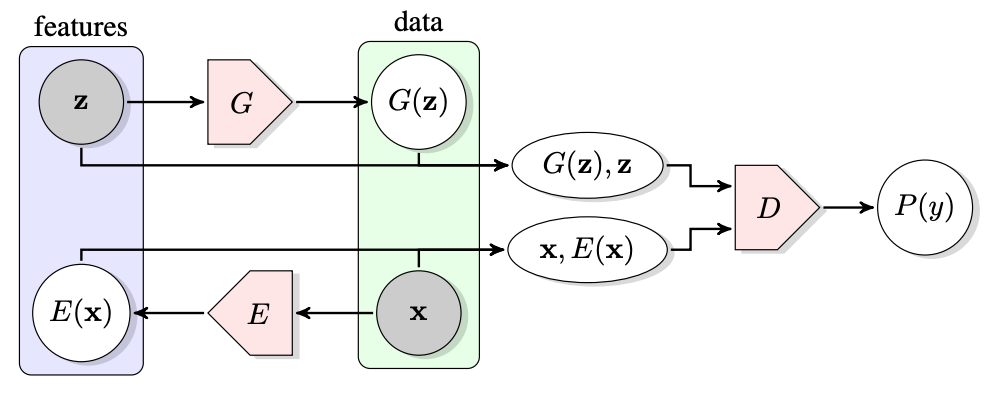
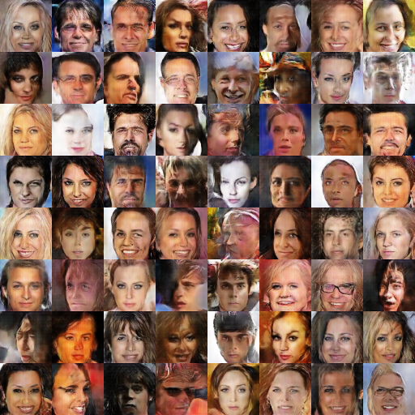

# TensorLayer-BiGAN


A TensorLayer implementation of [Adversarial Feature Learning](https://arxiv.org/abs/1605.09782), which is also known as BiGAN. 




## Prerequisites

- Python 3.7
- TensorFlow 2.0.0
- TensorLayer 2.1.1

We highly recommend you to install the packages above using Anaconda (or Miniconda).

### Install TensorFlow with GPU support

``` bash
conda create -n bigan python=3.7 tensorflow-gpu
```

### Install TensorFlow with only CPU support

``` bash
conda create -n bigan python=3.7 tensorflow
```

### Install TensorLayer

```bash
conda activate bigan && pip install tensorlayer
```


## Usage

### Evaluation

First, download the pre-trained weights from [here](https://github.com/YOUSIKI/TensorLayer-BiGAN/releases).

Second, use the follow script to generate an images.

``` bash
python eval.py
```

This will ganerate 8x8 fake human faces and save the image to `samples.png`. For further evaluation usage, please read the code in `eval.py` and modify it as you like.

### Training

Clone this repository to your computer.

``` bash
git clone https://github.com/YOUSIKI/BiGAN.TensorLayer.git
```

To train a BiGAN network from nothing, please download CelebA Dataset from eigher [Google Drive](https://drive.google.com/open?id=0B7EVK8r0v71pWEZsZE9oNnFzTm8) or [Baidu Netdisk](https://pan.baidu.com/s/1eSNpdRG#list/path=%2F). 

*Here, I recommend you to download only  `Img/img_align_celeba.zip` to save some time. Moreover, you may look for this dataset on other unofficial sites such as [BYR](https://bt.byr.cn/).*

After downloading the zip file, extract it to a fold such as `data` under the project directory. You can also extract it to other directories you like, but remember to modify `DATA_PATH` in `data.py` if you do so.

Next, use the follow script to train.

``` bash
python train.py
```

The training configurations can be found and modified in `config.py`.

If you want to train the network on your own dataset, please view every `.py` file and change them as your will.


## Result on CelebA



For more sample images saved during training, check `samples` folder.


## More

This project is mostly based on [dcgan implementation of tensorlayer](https://github.com/tensorlayer/dcgan), you may find this repository useful while reviewing the code. Many thanks to its contributors ([zsdonghao](https://github.com/zsdonghao) et al.)

We are just beginners of neural networks (and TensorLayer). There may be many mistakes in this project. Please contact us if you found. All issues and pull requests are welcomed.

